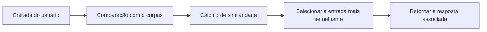
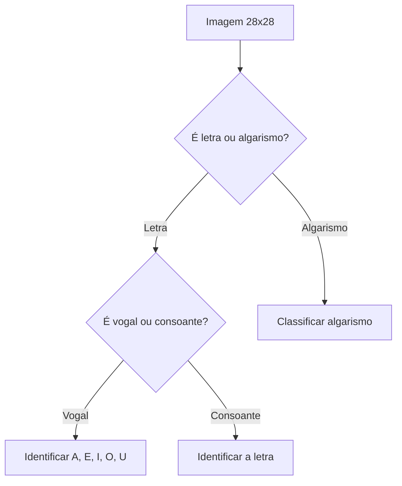

# Desafios do Boitatá

Este repositório reúne uma série de desafios de programação, inteligência artificial e aprendizado de máquina, organizados em ordem crescente de complexidade.

## Visão geral

Os temas abordados incluem:

- modelagem computacional e sistemas dinâmicos;
- redes neurais artificiais;
- processamento de linguagem natural;
- geração de textos aleatórios;
- classificação de imagens;
- redução de dimensionalidade e clusterização.

---

## 1. Bêbado Clássico, Bêbado Quântico e Atrator de Lorenz

Implementar e estudar computacionalmente os seguintes modelos e sistemas:

- Bêbado Clássico;
- Bêbado Quântico;
- Atrator de Lorenz.

### Objetivo

Analisar o comportamento dos sistemas, observar padrões e comparar a dinâmica de cada modelo.

---

## 2. Rede Neural para o Operador XOR

### 2.1. Implementação com NumPy

Implementar uma rede neural artificial utilizando apenas NumPy para resolver o problema do operador XOR.

A rede deve receber dois valores de entrada:

- A
- B

E produzir como saída:

- C = XOR(A, B)

### 2.2. Implementação direta do operador XOR

Implementar também o operador XOR por meio de uma abordagem computacional direta.

A função deve receber A e B e retornar C, de acordo com a lógica:

```text
XOR(A, B) -> C
```

### Objetivo

Treinar a rede para aprender corretamente a função XOR e validar o comportamento da rede.

---

## 3. Chatbot inspirado no ELIZA

Implementar um chatbot inspirado no funcionamento do ELIZA, porém com um tema específico e domínio de conhecimento restrito.

### Algoritmo

O chatbot deve utilizar uma base de conversas (corpus) contendo pares do tipo:

```text
entrada -> saída
```

O processamento deve seguir, aproximadamente, estas etapas:

1. O usuário fornece uma entrada;
2. A entrada é comparada com as entradas existentes no banco/corpus;
3. É calculada uma medida de similaridade entre a entrada do usuário e cada entrada da base;
4. É encontrada a entrada com maior similaridade;
5. O chatbot retorna a saída associada à entrada mais semelhante.

### Fluxo

```text
Entrada do usuário
        ↓
Banco/Corpus de conversas
        ↓
Cálculo de similaridade
        ↓
Entrada com maior similaridade
        ↓
Saída correspondente
```



### Restrição

O corpus deve possuir:

- N > 1.000.000 registros

---

## 4. Gerador de Frases Aleatórias — Teoria do Macaco Infinito

Implementar um gerador de frases aleatórias inspirado na Teoria do Macaco Infinito, associada a Émile Borel.

### Restrições

O gerador deve:

- produzir frases com 3 palavras;
- gerar as palavras respeitando regras de formação de palavras da língua portuguesa;
- considerar combinações entre vogais, consoantes, sílabas e padrões possíveis de formação de palavras em português.

### Exemplo simplificado

```text
C + V + C + V
```

Onde:

- C = consoante;
- V = vogal.

### Base de frases

Gerar uma base contendo:

- N > 100.000 frases

---

## 5. Classificação de Imagens 28 × 28

Dada uma imagem de 28 × 28 pixels, em escala de cinza, utilizar técnicas de aprendizagem de máquina para realizar uma classificação hierárquica.

### 5.1. Letra ou Algarismo

Determinar se a imagem representa:

- uma letra; ou
- um algarismo.

```text
Imagem 28 × 28
      ↓
Letra ou Algarismo?
```

### 5.2. Vogal ou Consoante

Caso a imagem seja identificada como uma letra, determinar se ela é:

- vogal; ou
- consoante.

```text
Letra
  ↓
Vogal ou Consoante?
```

### 5.3. Identificação da Letra

Se for uma vogal, identificar qual vogal:

- A, E, I, O, U

Caso seja uma consoante, identificar qual é a letra.

### Fluxo completo

```text
Imagem 28 × 28
      ↓
Letra / Algarismo
      ↓
   Se letra
      ↓
Vogal / Consoante
      ↓
 ┌───────────────┐
 │               │
Vogal        Consoante
 │               │
 ↓               ↓
A, E, I, O, U    Identificação
                 da letra
```



---

## 6. Clusterização e PCA — Conjunto de Dados de Dígitos

Utilizar um conjunto de dados de dígitos manuscritos e aplicar técnicas de aprendizado não supervisionado.

### Procedimentos

- carregar o conjunto de dados;
- realizar a preparação/pré-processamento dos dados;
- aplicar clusterização;
- aplicar PCA (Principal Component Analysis);
- visualizar os dados após a redução de dimensionalidade;
- analisar se os diferentes dígitos formam clusters visualmente identificáveis.

### Objetivo

Verificar se é possível observar uma separação natural entre os diferentes dígitos após a aplicação de PCA e clusterização.

---

## 7. PCA e Clusterização nos Super Trunfos

Aplicar as técnicas de:

- PCA;
- clusterização;

ao conjunto de dados dos Super Trunfos.

### Objetivo

Investigar se os atributos das cartas formam agrupamentos naturais e verificar, por meio de uma representação em menor dimensionalidade, se esses grupos podem ser visualizados.

---
